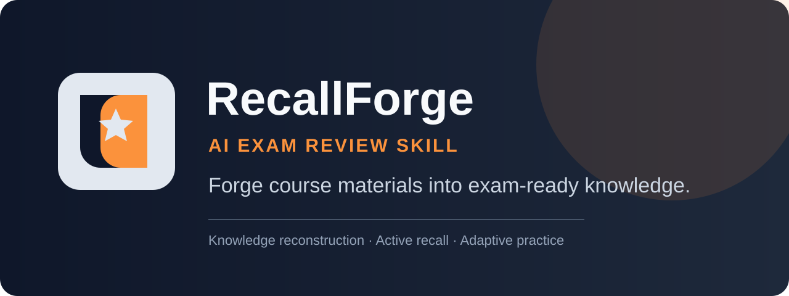
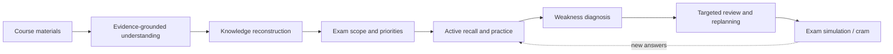
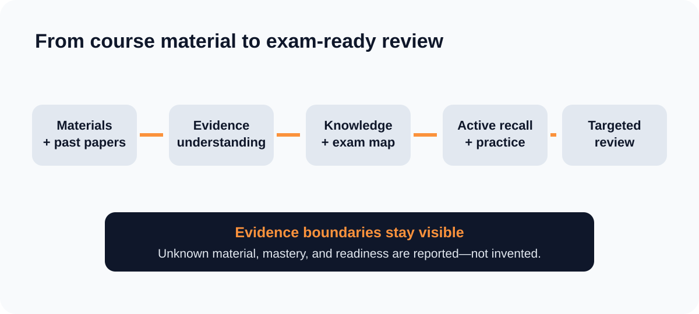
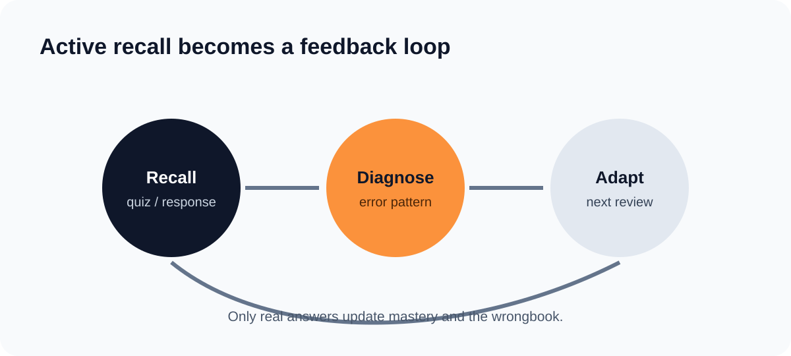

<p align="center"></p>

<p align="center"><a href="README.zh-CN.md">简体中文</a> · <strong>English</strong></p>

<p align="center"><a href="https://github.com/SiriZhao/recallforge-skill/releases/latest">Download latest release</a> · <a href="#quick-start">Quick start</a> · <a href="docs/getting-started.md">Beginner guide</a> · <a href="CONTRIBUTING.md">Contribute</a></p>

# RecallForge — AI Exam Review Skill

**Forge course materials into exam-ready knowledge.**

RecallForge is an open-source, local-first Python skill for exam review. It turns course materials and past papers into evidence-linked knowledge models, active-recall practice, weakness diagnosis, targeted review plans, and time-boxed exam preparation. It is not a generic “summarize this PDF” prompt.

> Use only course materials you own or are authorized to use. RecallForge supports learning; it cannot guarantee an exam result.

## Why RecallForge?

Passive rereading and generic AI summaries often lose the exam context: what is actually assessed, what you cannot yet recall, and what to do next. RecallForge keeps those pieces connected:



## What it does

- **Material understanding** — reads TXT natively; optional PDF, DOCX, PPTX, image, and OCR support is available through the ingestion extra and configured provider.
- **Knowledge reconstruction** — builds course-scoped topics with evidence references, terminology maps, conflicts, coverage, and prerequisite-aware relationships.
- **Exam mapping** — analyzes past-exam structure, teacher emphasis, risk priorities, and source-supported exam points.
- **Active recall and adaptive practice** — produces quizzes, records real answers, and keeps mastery unknown until evidence exists.
- **Weakness detection** — diagnoses wrong answers and feeds a wrongbook, review planning, later practice, and cram plans.
- **Exam-week planning** — coordinates multiple courses while preserving per-course knowledge isolation.
- **Bilingual workflow** — Chinese, English, bilingual output, and mixed-language terminology support.

The illustrations below are **schematic examples derived from RecallForge’s documented CLI workflow**, not GUI screenshots.

<p align="center"></p>
<p align="center"></p>

More examples: [knowledge reconstruction](assets/screenshots/knowledge-reconstruction.svg), [weakness detection](assets/screenshots/weakness-detection.svg), and [exam simulation](assets/screenshots/exam-simulation.svg).

## Quick start

### 1. Download (recommended for most users)

Open [Releases](https://github.com/SiriZhao/recallforge-skill/releases/latest), download `recallforge-skill-v2.0.0.zip`, and extract it somewhere you can find again. This is a Python command-line skill, so you need Python 3.10 or newer.

Open **PowerShell** on Windows or **Terminal** on macOS/Linux, move into the extracted folder, then run:

```bash
python -m pip install .
recallforge --help
```

If the second command shows commands beginning with `workspace`, installation worked. On Windows, use `py` if `python` is not recognized.

### 2. Create your first review workspace

```bash
recallforge workspace init --dir ./my-review --locale en-US --daily-hours 3
recallforge workspace add-course --dir ./my-review --course probability --name "Probability" --exam-date 2026-12-18 --target-score 80
recallforge workspace ingest --dir ./my-review --course probability --input ./examples/input
recallforge workspace build --dir ./my-review --course probability --days-to-exam 7
recallforge workspace material-report --dir ./my-review --course probability
```

For Chinese output, replace `--locale en-US` with `--locale zh-CN` and use your Chinese course name. The last command should print a material inventory, gaps, risk, and next steps.

### Other installation methods

- **Installer script:** Windows: `powershell -ExecutionPolicy Bypass -File .\scripts\install.ps1`; macOS/Linux: `bash ./scripts/install.sh`. Add `--target <folder>` to choose an install folder. These scripts copy the package; run `python -m pip install .` inside that folder afterwards.
- **Git clone (developers):** `git clone https://github.com/SiriZhao/recallforge-skill.git && cd recallforge-skill && python -m pip install -e ".[test]"`.
- **Manual fallback:** copy the extracted folder to any folder you control, open a terminal there, and run `python -m pip install .`.

Need a click-by-click explanation? Read the full [Getting Started guide](docs/getting-started.md) or [中文入门指南](docs/getting-started.zh-CN.md).

## Typical workflow

```bash
# Plan today across your courses
recallforge workspace plan-v4 --dir ./my-review --date 2026-12-11

# Learn, then test active recall
recallforge workspace tutor --dir ./my-review --course probability --topic central_limit_theorem
recallforge workspace quiz --dir ./my-review --course probability --mode s-priority --count 5

# Record a real result; an incorrect answer updates the wrongbook
recallforge workspace answer --dir ./my-review --course probability --topic central_limit_theorem --correct

# Prepare under time pressure
recallforge workspace cram --dir ./my-review --course probability --mode 1h
```

See [usage](docs/usage.md) for quick review, systematic review, weakness repair, past-paper review, active recall, and simulated exam output. See [examples](examples/) for small self-authored scenarios in probability, organic chemistry, computer science, and biology.

## Files, privacy, and limits

- Core processing is local. If you configure an external multimodal provider for scanned or image-heavy materials, the relevant material may be sent to that provider.
- Unconfigured visual parsing fails closed: unresolved material is reported instead of invented.
- OCR is opt-in and low confidence. Formula ambiguity remains low confidence until resolved.
- Readiness and likelihood values are ordinal heuristics, not grade predictions.
- Do not upload personal data, API keys, restricted exams, or unauthorized course materials. Details: [Security policy](SECURITY.md).

## For developers

```bash
git clone https://github.com/SiriZhao/recallforge-skill.git
cd recallforge-skill
python -m pip install -e ".[test]"
python -m compileall recallforge
python -m pytest
python scripts/build_release.py
```

Project map: `recallforge/` is the runtime, `schemas/` validates persisted state, `tests/` verifies behavior, and `examples/` contains safe sample scenarios. Read the [architecture](docs/architecture.md), [contributing guide](CONTRIBUTING.md), and [troubleshooting guide](docs/troubleshooting.md).

## Feedback and roadmap

- [Report a bug](https://github.com/SiriZhao/recallforge-skill/issues/new?template=bug_report.yml)
- [Request a feature](https://github.com/SiriZhao/recallforge-skill/issues/new?template=feature_request.yml)
- [Improve documentation](https://github.com/SiriZhao/recallforge-skill/issues/new?template=docs.yml)

Near-term directions: broader course-format support, more adaptive review strategies, and additional runtime compatibility—only where they remain evidence-grounded and testable.

## License

[MIT](LICENSE)
