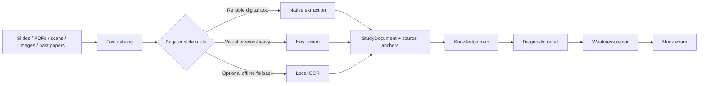

<p align="center"></p>

<p align="center"><strong>English</strong> · <a href="README.zh-CN.md">简体中文</a></p>

<p align="center"><a href="https://github.com/SiriZhao/recallforge-skill/releases/latest">Download latest release</a> · <a href="#quick-start">Quick start</a> · <a href="docs/examples.md">Examples</a> · <a href="docs/materials.md">Supported materials</a> · <a href="docs/faq.md">FAQ</a></p>

# RecallForge — AI Exam Review Skill

**Turn slides, scanned textbooks, notes, images, and past papers into an adaptive exam-review workflow.**

RecallForge is a host-executed Skill for Codex and compatible Agent Skills hosts. It begins with material inspection—not a long summary—then reconstructs course knowledge, tests recall, diagnoses demonstrated weaknesses, targets repair, and can finish with a source-grounded mock exam.

> RecallForge **v2.2.0** is the current release, verified on a real Codex host and on Windows/macOS/Linux CI.

```text
$recallforge
I have a final next week.
Materials: 8 lecture decks, a scanned textbook, and 3 past papers.
Build the course structure first, then test what I actually know.

→ RecallForge inspects the materials it can access, reports recognition issues,
  builds a source map, then starts a short diagnostic recall round.
```

## What you can give it

| Material | Core path | Visual path | Verified status |
|---|---|---|---|
| PPTX | Titles, text boxes, tables, notes, slide order | Rendered slide for diagrams/layout when the host or LibreOffice path is available | Native fixture verified; visual path verified in Codex E2E |
| Digital PDF | Page-level native text and layout blocks | Selective rendering for figures/formulas | Verified with self-authored fixtures |
| Scanned PDF | Scan detection per page | Host vision first; optional local OCR fallback | Detection/rendering verified; host vision verified in Codex E2E |
| PNG/JPG/JPEG/WEBP | File detection | Host vision | Routing verified; host execution verified in Codex E2E |
| DOCX | Paragraphs and structured tables | Optional rendered verification | Native fixture verified |
| TXT/Markdown | Native text | Not normally needed | Verified |
| Formulas/tables/diagrams | Dedicated IR blocks and source anchors | Precision pass when uncertain | Static/native paths verified; host vision verified in Codex E2E |
| Past papers | Question/options/score/source structure when extractable | Multi-column/figure/handwriting verification | Fixture path verified |

Status language: **Verified** means an automated fixture ran here. **Host-dependent** means the workflow is implemented but depends on the selected AI host’s visual capability. No claim means “works everywhere.”

Local OCR was benchmarked on a Windows 11 CPU reference machine: Tesseract 5.5.0 and RapidOCR 1.2.3 both completed 10/10 self-authored fixtures. Neither is treated as verified understanding; see [Local OCR verification](docs/ocr.md) for CER/WER, speed, and the recommended processing matrix.

## Material Intelligence



RecallForge does not reduce every page to OCR text. It preserves slide grouping, tables, formulas, diagrams, annotations, question structure, confidence, and page/slide anchors. Every unit must be processed or carry a reason; uncertain formulas and visual blocks stay uncertain.

## Example gallery

All gallery assets are **documentation illustrations built from self-authored fixtures**, not screenshots of a proprietary UI or private course material.

| Lecture slides | Scanned textbook | Past exam |
|---|---|---|
| [PPTX → slide blocks and source anchors](assets/showcase/lecture-slides.svg) | [Scan → vision/OCR with uncertainty](assets/showcase/scanned-page.svg) | [Questions → choices, scores, annotations](assets/showcase/past-paper.svg) |
| Formula-heavy | Organic chemistry | Botany diagram |
| [Formula → raw + interpreted + confidence](assets/showcase/formula.svg) | [Reaction structure stays visual](assets/showcase/organic-chemistry.svg) | [Labels and relationships stay visual](assets/showcase/botany.svg) |

See the [complete learning-flow examples](docs/examples.md).

## Quick start

The core Skill needs no Python, API key, server, or separate RecallForge program. Optional local OCR acceleration may require additional local dependencies.

1. Download `recallforge-skill-v2.2.0.zip` from the [latest formal Release](https://github.com/SiriZhao/recallforge-skill/releases/latest).
2. Extract it and copy the `recallforge` folder to `%USERPROFILE%\.agents\skills` on Windows or `~/.agents/skills` on macOS/Linux.
3. Start a new Codex turn.
4. Run `$recallforge self-test` and confirm `Status: READY`.
5. Attach one chapter or a small set of materials and run `$recallforge inspect-materials`.
6. Start your review with the prompt below.

```text
$recallforge
I am preparing for an exam.
Course: [course]
Materials: [attach slides, PDFs, scans, images, or paste notes]
Inspect the material first. Build an exam-focused course structure,
then guide me through active recall and focus on demonstrated weak areas.
Do not overwhelm me with everything at once.
```

For project-only installation, Windows/macOS/Linux instructions, updates, and removal, use the [Codex guide](docs/codex.md) or [beginner guide](docs/getting-started.md).

## Self-tests

### 30-second text test

Run `$recallforge self-test`. A correct response ends with `Status: READY` and includes four probability topics, an active-recall question, one practice item, and a next step.

### Multimodal test

Attach or expose [the self-authored test slide](skill/recallforge/assets/self-test/multimodal/probability-slide.svg), then run `$recallforge multimodal-test`. A capable host should identify the formula, table comparison, and arrow relationship, and end with `Status: MULTIMODAL_READY`.

If the host cannot inspect the asset, the expected result is `MULTIMODAL_HOST_CAPABILITY_UNAVAILABLE`—not a fabricated pass. Follow the [2–3 minute manual verification](docs/manual-verification.md).

## What RecallForge is—and is not

RecallForge is a **material-to-adaptive-review workflow executed by your AI host**. It is not a PDF summarizer, OCR product, flashcard-only generator, standalone chatbot, web app, model, or upload service. Native extraction and the optional Python toolkit support development and local preprocessing; the installed core Skill remains instruction-driven and zero-config.

Past-paper frequency and explicit teacher wording can inform priorities, but never prove what will appear on the next exam. Course sources remain the primary scope; external model knowledge must be labeled as supplementary.

## Compatibility and privacy

| Host/path | Status |
|---|---|
| Codex user/repo Skill directories | Verified on Codex 0.147.0 / Windows 11 (`/skills` discovery passed) |
| Codex/ChatGPT Skill UI metadata | Included; Codex host E2E passed; other UI surfaces not individually tested |
| Skills-only Plugin | Manifest/package validated locally |
| Other Agent Skills hosts | Standard-compatible core folder; not individually host-tested |

RecallForge operates no server or upload service. Material handling by the AI model follows the privacy and data policies of the host and model provider you choose. Use only materials you own or are authorized to process, and remove unnecessary personal data.

## Documentation

- [Getting started](docs/getting-started.md) · [Codex](docs/codex.md)
- [Materials guide](docs/materials.md) · [Multimodal guide](docs/multimodal.md)
- [Why RecallForge](docs/why-recallforge.md) · [Architecture](docs/architecture.md)
- [Examples](docs/examples.md) · [FAQ](docs/faq.md) · [Troubleshooting](docs/troubleshooting.md)
- [Manual host verification](docs/manual-verification.md)
- [Local OCR verification](docs/ocr.md)
- [Tested environment](docs/tested-environment.md)
- [Native ingestion benchmark](benchmarks/README.md)

If RecallForge helps, starring the repository, reporting an issue, or contributing an improvement is appreciated. See [Contributing](CONTRIBUTING.md), [Security](SECURITY.md), and [MIT License](LICENSE).
