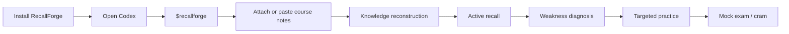

<p align="center"></p>

<p align="center"><strong>English</strong> · <a href="README.zh-CN.md">简体中文</a></p>

<p align="center"><a href="https://github.com/SiriZhao/recallforge-skill/releases/latest">Download</a> · <a href="#30-second-installation-test">30-second test</a> · <a href="docs/codex.md">Codex guide</a></p>

# RecallForge — AI Exam Review Skill

**Forge course materials into exam-ready knowledge.**

RecallForge is a host-executed AI Skill for Codex and compatible Agent Skills hosts. Install the `recallforge` folder once, then use it inside your AI host to reconstruct knowledge, practice active recall, identify real weak areas, and prepare for exams. It is not a web app, a separate chatbot, an API service, or a program you need to run.

```text
$recallforge
I have a final next week. Here are my lecture notes.
Test what I actually know and focus on my weak areas.

→ Knowledge map created. Let's start with a diagnostic recall round.
```

## Download and install

Download the latest [Release](https://github.com/SiriZhao/recallforge-skill/releases/latest). Choose once:

| You are… | Choose | Install to |
|---|---|---|
| A student or regular Codex user | `recallforge-skill-v2.1.2.zip` | User-level Skill folder |
| A Windows user who wants the easiest setup | The Skill ZIP + `install.ps1` | User-level Skill folder |
| A macOS/Linux user | The Skill ZIP + `install.sh` | User-level Skill folder |
| A developer | Git clone | Project-local `.agents/skills` |
| A Plugin user | `recallforge-plugin-v2.1.2.zip` | Host Plugin flow |

### User installation (recommended)

Extract `recallforge-skill-v2.1.2.zip`. It contains one folder: `recallforge`. Copy that folder to your user Skills directory:

- **Windows:** `%USERPROFILE%\.agents\skills\recallforge`
- **macOS/Linux:** `~/.agents/skills/recallforge`

You do not need Python, npm, an API key, or a separate RecallForge app.

**Windows PowerShell shortcut** (run from the extracted release):

```powershell
powershell -ExecutionPolicy Bypass -File .\scripts\install.ps1
```

**macOS/Linux shortcut** (run from the extracted release):

```bash
bash ./scripts/install.sh
```

Both scripts install only RecallForge and back up an existing RecallForge folder when invoked with `--force` / `-Force`.

### Project-only installation

For a single project, create this structure at the project root instead:

```text
your-project/
└── .agents/
    └── skills/
        └── recallforge/
            └── SKILL.md
```

This keeps RecallForge available only when Codex is launched in that project. Developers can use:

```bash
git clone https://github.com/SiriZhao/recallforge-skill.git
cp -R recallforge-skill/skill/recallforge ./your-project/.agents/skills/
```

## 30-second installation test

1. Start a **new Codex turn** so it discovers the newly installed Skill.
2. Run: `$recallforge self-test`
3. Confirm the response includes `Status: READY`.

Expected result: the mini probability course yields four topics, one active-recall question, one exam-style question, and a next step. If it does not, see [Troubleshooting](docs/troubleshooting.md).

## See RecallForge in action



### Your first real review

```text
$recallforge
I am preparing for an exam.
Course: [course name]
Exam date: [optional]
Materials: [attach files or paste notes]
Please first build an exam-focused knowledge structure. Then guide me through active recall and identify my weak areas. Do not overwhelm me with everything at once.
```

### Useful modes

```text
$recallforge
I have 90 minutes before my exam. Prioritize the highest-value concepts, test me using active recall, and focus on mistakes and weak areas.
```

```text
$recallforge
I already studied this once. Do not summarize everything again. Test me first, identify what I do not understand, and only review my weak areas.
```

```text
$recallforge
Create a mock exam based only on the material I provided. Do not reveal answers first. Grade my answers, explain mistakes, and create a targeted final review.
```

## Explicit and automatic invocation

- **Explicit:** `$recallforge` is the most reliable first-use path. Use it for self-test and any review session.
- **Automatic:** Codex may select RecallForge when users mention final/midterm preparation, course or lecture notes, active recall, weak topics, mock exams, study guides, revision, or exam practice. Automatic matching depends on the host; use explicit invocation when it does not trigger.
- **Not a trigger:** code/PR review, contract review, movie/product review, translation-only tasks, and generic summaries without an exam-learning goal.

## Functional test (2 minutes)

Paste this into Codex, with `$recallforge` if needed:

```text
I have a short probability quiz. My notes: Conditional probability describes the probability of A given B: P(A|B)=P(A∩B)/P(B). If A and B are independent: P(A∩B)=P(A)P(B). Bayes' theorem reverses conditional probability: P(A|B)=P(B|A)P(A)/P(B). Use RecallForge to help me review this material.
```

**Pass:** you see a knowledge structure, exam focus, active recall, at least one practice item, and a next step. **Not a pass:** only a paraphrased summary. In that case run `$recallforge` explicitly and retry.

## Compatibility

| Host | Status | Installation | Verified |
|---|---|---|---|
| Codex local Skill discovery | Supported | User or repo Skill | Yes — package, installer, and host discovery path validated |
| Codex Skill Installer | Supported | GitHub repo path: `skill/recallforge` | Yes — official installer contract verified; use on a new turn |
| Codex Plugin flow | Supported | Plugin ZIP | Package manifest validated locally |
| Other Agent Skills hosts | Compatible by standard | Manual `recallforge/` folder | Not host-tested |
| ChatGPT Desktop UI | OpenAI metadata included | Host-dependent | Not UI-tested here |

For exact Windows, macOS, Linux, updates, removal, and host behavior, read [RecallForge for Codex](docs/codex.md) and [compatible hosts](docs/compatible-hosts.md). The [Chinese Codex guide](docs/codex.zh-CN.md) covers the same onboarding in Chinese.

## What makes it different?

Normal chat often starts and ends with “summarize this PDF.” RecallForge runs a learning loop: material → knowledge structure → priorities → active recall → observed weaknesses → targeted review → mock exam. It does not claim mastery, source coverage, or exam likelihood without support.

Use only authorized material and follow academic-integrity rules. See [Security](SECURITY.md), [Contributing](CONTRIBUTING.md), and [Architecture](docs/architecture.md).
