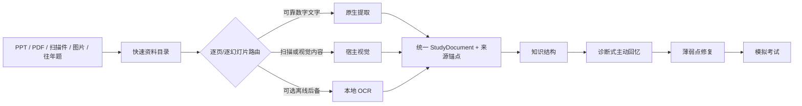

<p align="center"></p>

<p align="center"><strong>简体中文</strong> · <a href="README.md">English</a></p>

<p align="center"><a href="https://github.com/SiriZhao/recallforge-skill/releases/latest">下载正式版</a> · <a href="#三分钟开始使用">快速开始</a> · <a href="docs/examples.md">案例</a> · <a href="docs/materials.zh-CN.md">资料指南</a> · <a href="docs/faq.md">常见问题</a></p>

# RecallForge — AI Exam Review Skill

**把 PPT、扫描教材、图片、讲义和往年试卷直接交给 AI，从资料理解开始完成考试复习。**

RecallForge 是装载到 Codex 与兼容 Agent Skills 宿主中的复习 Skill。它不会一上来输出一篇长摘要，而是先检查资料和识别质量，再建立课程知识结构，通过主动回忆观察真实薄弱点，针对性修复，最后可生成有资料依据的模拟考试。

> RecallForge **v2.2.0** 是当前正式版本，已在真实 Codex 宿主以及 Windows/macOS/Linux CI 上完成验证。

```text
$recallforge
我下周要期末考试。
资料包括：8 份课件、一本扫描教材和 3 套往年题。
请先建立课程结构，再测试我真正掌握了什么。

→ RecallForge 先检查实际可访问的文件，说明识别问题和来源范围，
  建立资料地图，然后开始一轮简短的诊断式主动回忆。
```

## 能处理什么资料

| 资料 | 核心路径 | 当前真实状态 |
|---|---|---|
| PPTX | 标题、文本框、表格、备注、顺序和来源锚点；需要时走整页视觉 | 原生 fixture 已验证；视觉路径已在 Codex E2E 验证 |
| 数字 PDF | 按页原生文字和布局块，图示/公式选择性渲染 | 自制 fixture 已验证 |
| 扫描 PDF | 按页判断扫描属性，优先宿主视觉，可选本地 OCR | 检测和渲染已验证；宿主视觉已在 Codex E2E 验证 |
| PNG/JPG/JPEG/WEBP | 图片检测并交给宿主视觉 | 路由已验证；宿主执行已在 Codex E2E 验证 |
| DOCX | 段落和结构化表格 | 原生 fixture 已验证 |
| TXT/Markdown | 原生读取 | 已验证 |
| 公式、表格、图示 | 独立结构、置信度和来源锚点；不确定时精细处理 | 静态/原生路径已验证；宿主视觉已在 Codex E2E 验证 |
| 往年试卷 | 在可提取时区分题目、选项、分值、批注与来源 | fixture 路径已验证 |

“已验证”表示本仓库的自制 fixture 在当前测试环境中真实运行过；“依赖宿主”表示工作流已经实现，但最终视觉质量由所选 AI 宿主决定。

本地 OCR 已在 Windows 11 CPU 参考机器上做过真实基准：Tesseract 5.5.0 和 RapidOCR 1.2.3 都完成 10/10 个自制 fixture。两者都不能被视为已验证理解；CER/WER、速度和推荐矩阵见[本地 OCR 验证](docs/ocr.zh-CN.md)。

## 资料智能理解层



RecallForge 不会把所有页面无脑 OCR 成 TXT。它会尽量保留 PPT 空间关系、表格行列、公式、图示、批注、题目结构、置信度和页码/幻灯片编号。每一页都必须有处理状态；看不清的公式和图示会明确标记不确定。

## 产品案例

下列都是根据项目自制测试资料绘制的**文档示意图**，不是伪造的 Codex UI，也不包含私人课程资料。

| 课程 PPT | 扫描教材 | 往年试卷 |
|---|---|---|
| [PPTX → 空间块和来源](assets/showcase/lecture-slides.svg) | [扫描页 → 视觉/OCR 与不确定性](assets/showcase/scanned-page.svg) | [题目 → 选项、分值、批注](assets/showcase/past-paper.svg) |
| 公式资料 | 有机化学 | 植物学图示 |
| [公式 → 原始表示、解释和置信度](assets/showcase/formula.svg) | [结构式保持视觉对象](assets/showcase/organic-chemistry.svg) | [标签和结构关系保持视觉](assets/showcase/botany.svg) |

完整过程见[案例文档](docs/examples.md)。

## 三分钟开始使用

RecallForge 核心 Skill 不需要 Python、API Key、服务器或独立程序。只有可选的本地 OCR 加速可能需要额外依赖。

1. 从[最新正式 Release](https://github.com/SiriZhao/recallforge-skill/releases/latest)下载 `recallforge-skill-v2.2.0.zip`。
2. 解压，将 `recallforge` 文件夹复制到 Windows 的 `%USERPROFILE%\.agents\skills`，或 macOS/Linux 的 `~/.agents/skills`。
3. 新建一个 Codex 对话。
4. 输入 `$recallforge self-test`，确认看到 `Status: READY`。
5. 先上传一个章节或一小组资料，输入 `$recallforge inspect-materials`。
6. 使用下面的第一次复习提示词。

```text
$recallforge
我要准备一次考试。
课程：[课程名称]
资料：[上传 PPT、PDF、扫描件、图片，或粘贴笔记]
请先检查资料质量并建立面向考试的课程结构，
再通过主动回忆逐步复习，只针对我真实暴露的薄弱点。
不要一次性输出所有内容。
```

项目级安装、Windows/macOS/Linux 完整步骤、更新和卸载请看 [Codex 中文指南](docs/codex.zh-CN.md)和[小白入门](docs/getting-started.zh-CN.md)。

## 两个自检

- `$recallforge self-test`：30 秒文本自检，正常结果以 `Status: READY` 结束。
- `$recallforge multimodal-test`：使用[项目自制多模态测试页](skill/recallforge/assets/self-test/multimodal/probability-slide.svg)，应识别公式、对比表格和箭头关系，并以 `Status: MULTIMODAL_READY` 结束。

如果宿主无法查看测试图，应返回 `MULTIMODAL_HOST_CAPABILITY_UNAVAILABLE`，而不是假装成功。维护者可执行[两到三分钟人工验收](docs/manual-verification.zh-CN.md)。

## 产品边界、兼容性与隐私

RecallForge 是由 AI 宿主执行的“资料到自适应复习”工作流，不是 PDF 摘要器、OCR 产品、独立聊天软件、Web App 或上传服务。往年题频率和教师明确文字可以作为复习证据，但不能证明今年一定会考；课程资料始终是当前课程范围的主要依据。

Codex 的用户级 Skill 安装、`/skills` 发现、`$recallforge self-test`、`$recallforge multimodal-test` 和真实资料 E2E 已在 Codex 0.147.0 / Windows 11 上由维护者真实验证。其他兼容 Agent Skills 宿主没有被逐一实测。

RecallForge 自身不运营服务器或上传服务。资料如何被处理取决于你选择的 AI 宿主和模型提供方的隐私与数据政策。请只使用自己拥有或已获授权的资料，并删除不必要的个人信息。

## 文档

- [小白入门](docs/getting-started.zh-CN.md) · [Codex 指南](docs/codex.zh-CN.md)
- [资料指南](docs/materials.zh-CN.md) · [多模态指南](docs/multimodal.zh-CN.md)
- [为什么使用 RecallForge](docs/why-recallforge.md) · [架构](docs/architecture.md)
- [案例](docs/examples.md) · [常见问题](docs/faq.md) · [故障排查](docs/troubleshooting.md)
- [人工宿主验收](docs/manual-verification.zh-CN.md)
- [本地 OCR 验证](docs/ocr.zh-CN.md)
- [已验证环境](docs/tested-environment.zh-CN.md)
- [原生摄取基准](benchmarks/README.md)

如果 RecallForge 对你有帮助，欢迎 Star、提交 Issue 或贡献改进。项目没有空的 Sponsor/Donate 区。参见[贡献指南](CONTRIBUTING.md)、[安全政策](SECURITY.md)和 [MIT License](LICENSE)。
