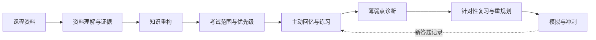

<p align="center"></p>

<p align="center"><strong>简体中文</strong> · <a href="README.md">English</a></p>

<p align="center"><a href="https://github.com/SiriZhao/recallforge-skill/releases/latest">下载最新版本</a> · <a href="#快速开始">快速开始</a> · <a href="docs/getting-started.zh-CN.md">小白教程</a> · <a href="CONTRIBUTING.md">参与贡献</a></p>

# RecallForge — AI Exam Review Skill

**将课程资料锻造成真正可用于考试的知识体系。**

RecallForge 是一个开源、以本地运行为主的 Python 复习 Skill。它会将课程资料和往年题组织为带证据来源的知识模型，支持主动回忆、薄弱点诊断、针对性复习计划和限时考前冲刺。它不是“把 PDF 丢给 AI 总结一下”的工具。

> 请只使用你拥有或已获授权的课程资料。RecallForge 是学习辅助工具，不保证考试成绩。

## 为什么是 RecallForge？

反复看资料和通用 AI 总结常常忽略三个关键问题：考试真正考什么、你目前回忆不出来什么、下一步应该学什么。RecallForge 将它们串成闭环：



## 已实现能力

- **资料理解**：原生读取 TXT；安装 ingestion 可选依赖并配置提供方后，可处理 PDF、DOCX、PPTX、图片和可选 OCR。
- **知识重构**：按课程隔离的知识点、证据引用、术语表、冲突、覆盖度和先修关系。
- **考试映射**：从往年题、教师强调等资料中构建考试点、风险优先级和可追溯依据。
- **主动回忆与自适应练习**：生成测验、记录真实答题；没有真实记录时掌握度保持“未知”。
- **薄弱点诊断**：错题分类后进入错题本，并影响后续练习、计划与冲刺。
- **多课程考试周计划**：协调多门课的时间，同时保证知识不跨课程混淆。
- **中英双语**：中文、英文、双语输出及混合语言术语支持。

下方均为**根据真实 CLI 工作流制作的示意图**，不是虚构的图形界面截图。

<p align="center"></p>
<p align="center"></p>

更多示意： [知识重构](assets/screenshots/knowledge-reconstruction.svg)、[薄弱点诊断](assets/screenshots/weakness-detection.svg)、[模拟考试](assets/screenshots/exam-simulation.svg)。

## 快速开始

### 1. 下载（最适合普通用户）

打开 [Releases](https://github.com/SiriZhao/recallforge-skill/releases/latest)，下载 `recallforge-skill-v2.0.4.zip` 并解压到自己找得到的位置。RecallForge 是 Python 命令行 Skill，需要 Python 3.10 或更高版本。

在 Windows 打开 **PowerShell**，在 macOS/Linux 打开 **终端**；进入解压后的目录，执行：

```bash
python -m pip install .
recallforge --help
```

如果第二条命令显示以 `workspace` 开头的命令，说明安装成功。Windows 中如果没有 `python` 命令，请尝试 `py`。

### 2. 建立你的第一个复习空间

```bash
recallforge workspace init --dir ./my-review --locale zh-CN --daily-hours 3
recallforge workspace add-course --dir ./my-review --course probability --name "概率论" --exam-date 2026-12-18 --target-score 80
recallforge workspace ingest --dir ./my-review --course probability --input ./examples/input
recallforge workspace build --dir ./my-review --course probability --days-to-exam 7
recallforge workspace material-report --dir ./my-review --course probability
```

最后一条命令应输出资料清单、资料缺口、风险和下一步建议。英文课程将 `--locale zh-CN` 改为 `--locale en-US` 即可。

### 其他安装方法

- **安装脚本**：Windows 执行 `powershell -ExecutionPolicy Bypass -File .\scripts\install.ps1`；macOS/Linux 执行 `bash ./scripts/install.sh`。可加 `--target <文件夹>` 指定安装位置。脚本复制项目后，请在安装目录执行 `python -m pip install .`。
- **Git Clone（开发者）**：`git clone https://github.com/SiriZhao/recallforge-skill.git && cd recallforge-skill && python -m pip install -e ".[test]"`。
- **手动兜底**：将解压目录复制到任意自己有权限的文件夹，打开终端进入该目录，运行 `python -m pip install .`。

需要一步一步讲解，请阅读[完整中文入门教程](docs/getting-started.zh-CN.md)；英文用户可阅读 [Getting Started](docs/getting-started.md)。

## 常用流程

```bash
# 为今天安排多门课复习
recallforge workspace plan-v4 --dir ./my-review --date 2026-12-11

# 学习一个知识点，然后进行主动回忆
recallforge workspace tutor --dir ./my-review --course probability --topic central_limit_theorem
recallforge workspace quiz --dir ./my-review --course probability --mode s-priority --count 5

# 记录真实结果；错误答案会更新错题本
recallforge workspace answer --dir ./my-review --course probability --topic central_limit_theorem --correct

# 考前限时冲刺
recallforge workspace cram --dir ./my-review --course probability --mode 1h
```

快速复习、系统复习、往年题、查漏补缺、主动回忆与模拟输出请见 [Usage](docs/usage.md)。安全的小型自制示例位于 [examples](examples/)。

## 隐私、资料与限制

- 核心处理在本地进行。若为扫描件或图片资料配置外部多模态提供方，相应资料可能发送给该提供方。
- 未配置的视觉解析会明确显示为未解决，不会编造内容。
- OCR 必须手动启用，且置信度较低；公式有歧义时会保持低置信度。
- 就绪度与可能性数值只是排序启发式，不是成绩预测。
- 不要上传个人信息、API Key、受限试卷或未经授权的课程资料。详见[安全政策](SECURITY.md)。

## 开发者

```bash
git clone https://github.com/SiriZhao/recallforge-skill.git
cd recallforge-skill
python -m pip install -e ".[test]"
python -m compileall recallforge
python -m pytest
python scripts/build_release.py
```

`recallforge/` 为运行时逻辑，`schemas/` 定义持久状态，`tests/` 验证行为，`examples/` 存放安全示例。详见[架构文档](docs/architecture.md)、[贡献指南](CONTRIBUTING.md)和[故障排查](docs/troubleshooting.md)。

## 反馈与路线图

- [提交 Bug](https://github.com/SiriZhao/recallforge-skill/issues/new?template=bug_report.yml)
- [提出功能建议](https://github.com/SiriZhao/recallforge-skill/issues/new?template=feature_request.yml)
- [改进文档](https://github.com/SiriZhao/recallforge-skill/issues/new?template=docs.yml)

近期方向：在可验证、可追溯的前提下扩展资料格式、完善自适应复习策略和运行环境兼容性。

## License

[MIT](LICENSE)
