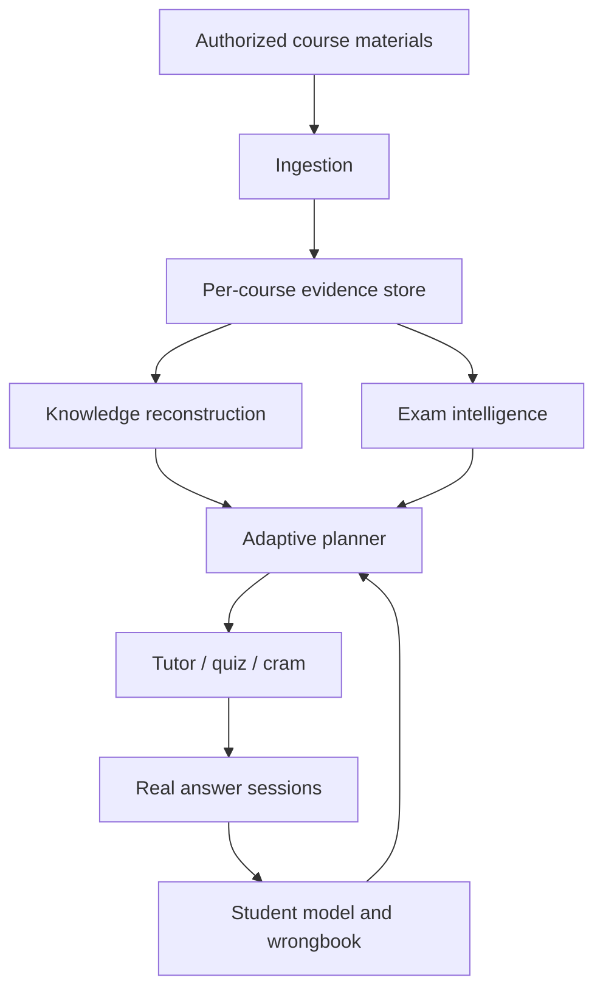

# Architecture

RecallForge is a local Python CLI and host-readable Skill definition. Its guiding rule is **course evidence before model guesswork**.

## Modules

- `recallforge/ingestion/`: classification, native parsing, optional visual routing, evidence records, and provider boundaries.
- `recallforge/knowledge/`: topics, evidence-linked exam model, risk, coverage, conflicts, and teacher-style tiers.
- `recallforge/student/` and `recallforge/tutor/`: real-answer mastery, diagnostic plans, quizzes, grading, diagnosis, wrongbook, and cram.
- `recallforge/planner/` and `recallforge/orchestrator/`: per-course and multi-course prioritization.
- `recallforge/state/`: workspace/course isolation and persisted JSON state.
- `schemas/`: machine-readable state contracts.

## State and trust boundaries

One workspace represents an exam period; each course has an isolated state directory. Knowledge evidence never crosses course boundaries. Only real answer events should alter the student model. Synthetic/demo material is guarded from entering real state. When a provider cannot resolve content, the pipeline stores the unresolved condition rather than inventing a claim.

## Extending RecallForge

Keep new features evidence-grounded, course-scoped, testable, and bilingual where they expose user-facing text. Add or update schemas for persisted state, add focused tests, and never turn heuristic values into claims of statistical certainty.
