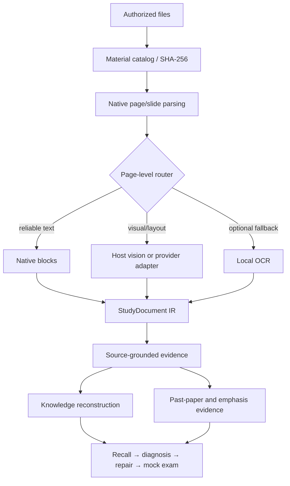

# Architecture

RecallForge has two deliberately separate layers:

1. **Core Skill:** `skill/recallforge/` is a zero-config, host-executed Agent Skill. It tells the host how to inspect material, preserve uncertainty, reconstruct knowledge, and run the learning loop.
2. **Optional Python toolkit:** `recallforge/` provides deterministic native parsing, normalized evidence, fixture tests, local state, and an opt-in OCR fallback for development or local preprocessing. End users do not need to run it.

## StudyDocument IR

Each document records an ID, filename, type, SHA-256, language hint, pages/slides, and warnings. Every page/slide records an index, title, typed blocks, notes, source anchor, route, processing level, status, confidence, hash, and warnings. Blocks can represent text, formula, table, diagram, image, annotation, or exam question.

The implementation intentionally favors a small dataclass IR over a large framework. Later review stages consume evidence with stable source anchors instead of format-specific text dumps.

## Routing and quality

- Native text wins when it is reliable and layout-independent.
- Images, scans, formulas, tables, diagrams, handwriting, rotated pages, suspicious text, and exam layouts request visual verification.
- If vision is unavailable, reliable native content is retained and only the visual portion is marked unresolved.
- Each page/slide ends as processed, processed with warning, skipped with reason, or failed with reason. This enforces zero silent page drop.
- Formula conflicts stay low-confidence; tables keep rows/cells; handwriting never becomes a verified answer silently.

## Providers and dependencies

The Python toolkit uses a provider registry rather than locking the core workflow to one vendor. The core Skill prefers the host’s existing visual tools. A synthetic provider exists only for deterministic tests and cannot enter real state. Local Tesseract OCR is opt-in, low-confidence, and optional; no OCR model or binary is redistributed.

Current optional library licenses are compatible with repository use, but system binaries/model data retain their own licenses: PyMuPDF (AGPL/commercial), pypdf (BSD-3-Clause), python-pptx/python-docx (MIT), Pillow (HPND), pytesseract (Apache-2.0), and Tesseract (Apache-2.0). Contributors must re-check licenses before redistribution, especially model weights and binaries.

## Incremental processing and state

The optional toolkit stores per-course evidence and file/content hashes in the selected workspace. Unchanged files and duplicate evidence are skipped. When explicitly configured, a render cache uses file hash + page/slide + profile + DPI keys. The instruction-only Skill does not promise a persistent cache or cross-session memory; within a conversation it merges new material into the current catalog.

## Extension rules

Keep new adapters evidence-grounded, page/slide-scoped, source-traceable, fail-closed, and optional for core installation. Add self-authored fixtures and lightweight CI tests. Heavy OCR/provider tests belong in optional integration jobs, not the default zero-config path.
